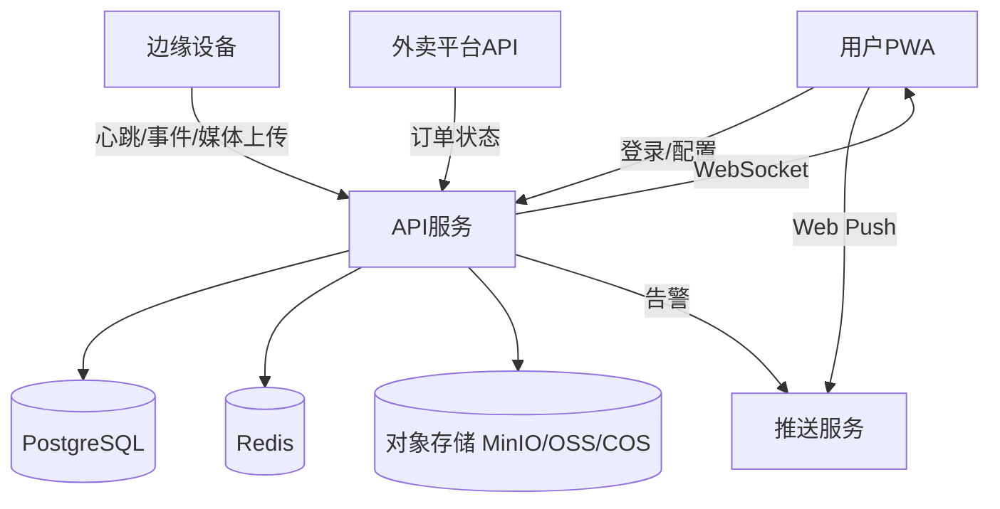

# 外卖防盗监控系统 技术方案与里程碑

## 技术方案选型对比

### 计算与边缘设备

| 方案 | 适用场景 | 优点 | 局限 |
| --- | --- | --- | --- |
| 树莓派 4B（4GB） | 需要本地识别、录像、并行任务 | 性能充足、生态成熟、接口丰富 | 成本较高、功耗较高 |
| 树莓派 Zero 2 W | 低成本、以抓拍为主 | 成本低、功耗低 | 性能偏紧张、实时识别受限 |
| Orange Pi 3 LTS | 价格更低、同类替代 | 成本低、可用性较好 | 生态和资料不如树莓派完善 |

### 摄像头方案

| 方案 | 优点 | 局限 |
| --- | --- | --- |
| RPi Camera v2 | 稳定、驱动成熟 | 视角与清晰度有限 |
| RPi HQ Camera | 清晰度高、适合取证 | 成本高、镜头需额外购买 |
| USB UVC 摄像头 | 通用、替换方便 | 体积偏大、低功耗适配较差 |

### 重量传感方案

| 方案 | 优点 | 局限 |
| --- | --- | --- |
| HX711 + 1-5kg 应变式传感器 | 成本低、实现简单 | 需要标定与抗噪声处理 |

### 声光警报

| 方案 | 优点 | 局限 |
| --- | --- | --- |
| 有源蜂鸣器 | 实现简单、功耗低 | 声音固定、不可调 |
| 无源蜂鸣器 | 可调频率、提示多样 | 驱动略复杂 |

### 后端框架

| 方案 | 优点 | 局限 |
| --- | --- | --- |
| FastAPI | 性能佳、类型清晰、异步友好 | 生态与Django相比略薄 |
| Flask | 轻量、学习成本低 | 需自行拼装大量组件 |
| Django | 自带ORM与管理后台 | 重量较大、异步体验一般 |

### 前端形态

| 方案 | 优点 | 局限 |
| --- | --- | --- |
| PWA | 跨平台、发布成本低 | 系统通知能力受浏览器限制 |
| React Native | 体验接近原生 | 需打包与上架流程 |
| 小程序 | 触达更快、分享便捷 | 平台限制较多、依赖审核 |

### 通信与推送

| 方案 | 优点 | 局限 |
| --- | --- | --- |
| WebSocket | 实时性强、适合警报 | 连接保持成本高 |
| MQTT | 轻量、省电 | 需额外Broker |
| Web Push | 无需自建推送 | 浏览器差异较大 |

本项目当前实现的MVP选型为：FastAPI + PostgreSQL + Redis + MinIO + PWA + Python边缘代理，默认可在本地Docker环境跑通。

## 系统架构图（Mermaid）



## 核心代码片段（示例）

### 外卖状态轮询（Python）

```python
import time
import requests

API_BASE = "https://provider.example.com"
TOKEN = "provider-token"

def poll_order(order_id: str):
    resp = requests.get(
        f"{API_BASE}/orders/{order_id}",
        headers={"Authorization": f"Bearer {TOKEN}"},
        timeout=10,
    )
    resp.raise_for_status()
    payload = resp.json()
    return payload.get("status"), payload

def loop(order_id: str, interval_sec: int = 30):
    while True:
        status, payload = poll_order(order_id)
        if status == "delivered":
            # 调用后端接口更新订单并触发提醒
            requests.post("http://api.local/api/v1/orders/manual-import", json=payload, timeout=10)
            break
        time.sleep(interval_sec)
```

### 摄像头动作触发录像（Python + OpenCV）

```python
import cv2
import time

cap = cv2.VideoCapture(0)
writer = None
last_frame = None
last_motion_ts = 0

def start_record():
    global writer
    fourcc = cv2.VideoWriter_fourcc(*"mp4v")
    writer = cv2.VideoWriter("clip.mp4", fourcc, 20.0, (640, 480))

def stop_record():
    global writer
    if writer:
        writer.release()
        writer = None

while True:
    ok, frame = cap.read()
    if not ok:
        time.sleep(0.5)
        continue
    if last_frame is None:
        last_frame = frame
        continue

    diff = cv2.absdiff(last_frame, frame)
    gray = cv2.cvtColor(diff, cv2.COLOR_BGR2GRAY)
    motion = (gray > 25).sum()

    if motion > 2000:
        last_motion_ts = time.time()
        if not writer:
            start_record()
    if writer:
        writer.write(frame)
        if time.time() - last_motion_ts > 5:
            stop_record()

    last_frame = frame
```

### 手机推送（JS，PWA）

```javascript
async function registerPush(vapidPublicKey) {
  const reg = await navigator.serviceWorker.register("/sw.js");
  const sub = await reg.pushManager.subscribe({
    userVisibleOnly: true,
    applicationServerKey: vapidPublicKey,
  });
  await fetch("/api/v1/me/push-subscriptions", {
    method: "POST",
    headers: { "Content-Type": "application/json", Authorization: `Bearer ${token}` },
    body: JSON.stringify(sub),
  });
}
```

## 里程碑与预算估算

### 里程碑（建议）

| 阶段 | 目标 | 产出 | 周期 |
| --- | --- | --- | --- |
| 需求与原型 | 场景确认、流程梳理 | 需求文档、原型图 | 1周 |
| 后端基础 | 订单、告警、证据 | API与DB | 2周 |
| 边缘采集 | 摄像头/重量事件 | 事件上报与录像 | 2周 |
| 前端PWA | 订单、告警、取证 | 可用界面 | 2周 |
| 联调与压测 | 端到端闭环 | Demo演示 | 1周 |
| 试点优化 | 误报处理、性能 | 版本迭代 | 1-2周 |

### 预算估算（人民币，单点位）

| 项目 | 选型 | 单价区间 | 备注 |
| --- | --- | --- | --- |
| 计算板 | 树莓派 Zero 2 W | 120-180 | 低成本方案 |
| 摄像头 | RPi Camera v2 | 120-180 | 可替换UVC |
| 传感器 | HX711 + 1-5kg | 15-35 | 选配 |
| 蜂鸣器 | 有源蜂鸣器 | 5-10 | 选配 |
| 存储卡 | 32GB | 30-50 | 必需 |
| 机箱/供电 | 基础套件 | 20-50 | 必需 |
| 云存储 | OSS/COS | 0-50/月 | 视量而定 |
| 合计 | 低配 | 330-555 | 不含云存储 |

备注：成本会受采购渠道与批量影响，预算仅作估算参考。
